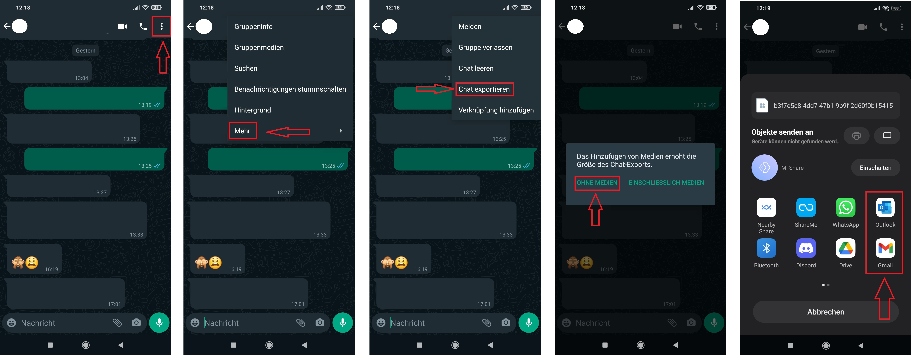
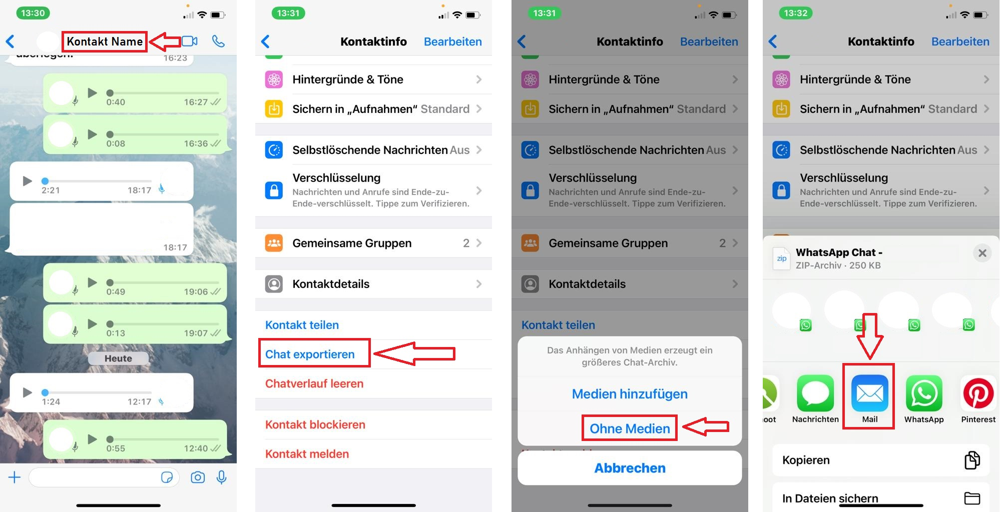

# Data Donation Workshop 24.03 - 26.03.2025 @ IfKW, LMU Munich

These are the data and materials for the workshop "Collecting and Analyzing WhatsApp Data Donations".
It consists of both a presentation and some hands-on-sessions to code along.

The workshop builds both on the WhatsR R-package ([https://github.com/gesiscss/WhatsR](https://github.com/gesiscss/WhatsR)) and the ChatDashboard R-shiny webapp ([https://github.com/gesiscss/ChatDashboard](https://github.com/gesiscss/ChatDashboard)) for data donations.

**Goal:**
Semi-ineractive Walk-through of the process for **preprocessing**, **collecting**, and **analyzing** donated WhatsApp Chat Log data.

## Schedule

| Time             | Block                                                                    |
|------------------|--------------------------------------------------------------------------|
| 09:00 - 09:15    | Presentation: Overview of WhatsApp Chat Log Data                         |
| 09:15 - 09:45    | **Code along:** Exporting & Parsing WhatsApp Chat Log Data               |
| 09:45 - 09:55    | Presentation: Anonymization & Consent Checking                           |
| 09:55 - 10:10    | **Code along:** Anonymization & Consent Checking                         |
| 10:10 - 10:20    | Presentation: ChatDashboard for Data Donation Studies                    |
| 10:20 - 10:45    | **Code along:** Installing and adapting ChatDashboard                    |
| 10:45 - 11:00    | Discussion, Q&A                                                          |

<br><br>

# Installing System Dependencies

We will use some R-packages that rely on specific system dependencies that you might need to install manually if your are using Linux or MacOS

### Windows

If you are using Windows, you should not have to install any system dependencies manually

### Linux

This should be run in the Terminal, not RStudio

```bash
sudo apt-get update
sudo apt-get install -y \
  libxml2-dev \
  libpng-dev \
  libsodium-dev \
  libcurl4-openssl-dev \
  libmagick++-dev \
  libharfbuzz-dev \
  libfribidi-dev \
  libjpeg-dev \
  default-jre \
  default-jdk \
  gfortran \
  libblas-dev \
  liblapack-dev \
  libgdal-dev
```
### MacOS

This should be run in the Terminal, not RStudio

```bash
brew update
brew install \
  libxml2 \
  libpng \
  libsodium \
  curl \
  imagemagick \
  harfbuzz \
  fribidi \
  jpeg \
  gcc \
  openblas \
  lapack \
  gdal

# Install Java (both JRE and JDK) using Homebrew Cask:
brew install --cask temurin
```

# Installing R Packages

ChatDashboard uses several additional R-packages on top of WhatsR to display data, make it interactive, and ensure encryption. Let's install these;

```
# Installing WhatsR package from GitHub
library(devtools)
devtools::install_github("gesiscss/WhatsR")

# Installing ChatDashboard Dependencies
Chatdashboard_dep <- c("anytime",
                       "crosstalk",
                       "cyphr",
                       "digest",
                       "DT",
                       "fontawesome",
                       "ggplot2",
                       "ggwordcloud",
                       "keyring",
                       "readODS",
                       "rsconnect",
                       "shiny",
                       "shinymanager",
                       "shinythemes",
                       "shinyjs",
                       "shinyalert",
                       "shinyTime",
                       "shinyWidgets",
                       "slickR",
                       "waiter",
                       "fs")
                       
Chatdashboard_new <- Chatdashboard_dep[!(Chatdashboard_dep %in% installed.packages()[,"Package"])]
if(length(Chatdashboard_new)) install.packages(Chatdashboard_new)

```
<br><br>

## Whatsapp Chat Logs

To fully participate in the workshop, participants need WhatsApp chat logs to analyze. these can be obtained in different ways:

### Export your own chat log

We recommend to export the chat files using the `without media` option and by sending it to a private Email address.

#### Android



<br>

#### iOS



<br><br>

### Create a dummy chat log file

Participants can also use the WhatsR package to create a dummy chat log file themselves

```
# loading library
library(WhatsR)

# checking documentation
??create_chatlog

# creating a dummy chat log
create_chatlog()

```

### Use the Example Chat logs provided in this repo

This repository contains multiple pre-generated example chat log files that can be used as well. Participants can find them in the `data` folder.
